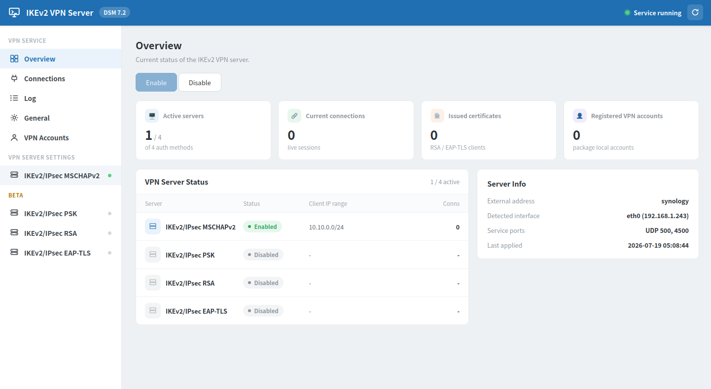

# Synology IKEv2 VPN Server 패키지

[English](README.md) | **한국어**

Synology NAS 기기에서 IKEv2 VPN Server를 사용하기 위한 패키지입니다.

Synology DSM에 독립형 IKEv2/IPsec VPN 서버를 추가하는 서드파티 패키지로, 패키지에 내장된 사전 컴파일된 strongSwan을 사용합니다.

## 미리보기

## 지원 NAS 플랫폼
- DSM 7.2 이상
- x86_64 아키텍처를 사용하는 NAS

## 지원 계획
- 향후 지원 가능한 모든 아키텍처의 Synology NAS를 지원할 계획입니다.
- **※ 아직 자동 차단 기능이 정작 작동하지 않습니다. ※**

## 지원 인증 방식
아래 서비스는 중복으로 동시에 서비스할 수 있으며, 각각 **독립된 클라이언트 IP 대역**을 가집니다.

| 방식 | 기본 IP 대역 | 설명 | 비고 |
|----------------|:------------:|---|:-:|
| IKEv2/IPSec MSCHAPv2 | 10.10.0.0/24 | ID/PW 인증 (패키지 자체 VPN 계정 또는 DSM 사용자 계정) | |
| IKEv2/IPSec PSK      | 10.11.0.0/24 | 사전 공유 키 | Beta |
| IKEv2/IPSec RSA      | 10.12.0.0/24 | 클라이언트 인증서(pubkey). 패키지 내장 CA로 .p12 발급 | Beta |
| IKEv2/IPSec EAP-TLS  | 10.13.0.0/24 | EAP 기반 클라이언트 인증서 | Beta |

- 암호화 제안(IKE/ESP cipher)은 "일반 설정" 페이지에서 전체 방식 공통으로 **자동 / AES-256 / AES-128** 중 선택할 수 있습니다.
- Windows 기본 IKEv2/IPSec 클라이언트는 PSK 방식을 지원하지 않습니다.
- 관리 화면은 브라우저 언어에 따라 한국어 / 영어로 자동 표시됩니다.

### IKEv2 MSCHAPv2 DSM 사용자 계정 인증
MSCHAPv2(ID/PW) 인증 방식을 이용해 DSM 사용자 계정을 통해 로그인하기 위해서는 모든 로컬 계정 패스워드의 **NT 해시**를 필요로 합니다. 하지만 DSM에서는 로컬 계정의 패스워드를 **공식적으로 NT 해시로 제공하지 않고 당연히 알 수도 없습니다.** \
하지만 Synology DSM의 자체 파일인 `/usr/syno/etc/synosmbpasswd.conf`에는 `사용자명=NT해시` 형태로 SMB 서비스를 이용하기 위해 NT 해시를 보관하고 있습니다. 때문에 해당 패키지는 Synology DSM의 자체 파일에서 NT 해시를 읽어와 DSM 사용자 계정 인증을 수행합니다.

- 서비스가 시작/재시작될 때 마다 `synosmbpasswd.conf`에서 해시를 새로 읽어 계정을 등록하므로, 계정 추가, 삭제, 비밀번호 변경은 서비스를 재시작하였을 때 반영됩니다.
- **비활성화(만료)되었거나 비밀번호가 없는 계정은 자동으로 제외**됩니다
    - 예: admin, guest

## 설치 방법
### 준비
- [SSH를 활성화](https://www.synology.com/knowledgebase/DSM/tutorial/General_Setup/How_to_login_to_DSM_with_root_permission_via_SSH_Telnet)하여 NAS에 로그인할 수 있도록 하세요
- 기존에 VPN Server 패키지를 이용해 **L2TP/IPSec VPN 서버를 사용하고 있었다면 비활성화**하세요
    - 이 패키지의 UDP 500/4500 포트가 충돌하여 동시에 사용할 수 없습니다

### 설치
1. "패키지 센터"로 이동
2. 오른쪽 상단의 "수동 설치" 버튼 클릭
3. [릴리스 페이지](../../releases)에서 다운로드한 spk 패키지 파일을 선택
4. "설치 확인" 단계에서 왼쪽 하단에 있는 "설치 후 실행하십시오"를 선택 해제
5. 설치가 완료되었으면 SSH에서 다음 명령어를 실행
    - `sudo /var/packages/IKEv2VPN/target/bin/ikev2-setup install`
6. 패키지 센터에서 "IKEv2 VPN Server" 패키지를 시작

## 제거 방법
- 이 패키지는 root 권한을 요구하는 패키지로 패키지 제거 전 부여했었던 root 권한을 회수해야 합니다
    - 회수하지 않아도 보안에 큰 문제는 없습니다만 진행하시는 것을 권장합니다

### 제거
1. 패키지 제거 전 아래 커맨드를 실행해주세요
    - `sudo /var/packages/IKEv2VPN/target/bin/ikev2-setup remove`
2. "패키지 센터"에서 패키지 제거

## 라이선스

이 패키지는 **GPL-2.0-or-later**로 배포됩니다 ([`LICENSE`](LICENSE)).
strongSwan 6.0.7(GPL-2.0-or-later, OpenSSL 링크 예외)의 `charon`/`swanctl`
바이너리와 관리 UI가 사용하는 Preact + htm 번들(MIT / Apache-2.0)을 번들하며,
GMP(LGPL/GPL)는 번들 없이 동적 링크만 합니다. 제3자
고지와 소스 제공 서면 오퍼는 [`THIRD_PARTY_NOTICES.md`](THIRD_PARTY_NOTICES.md)를
참고하세요.

- Copyright (C) 2026 jungjin00031
